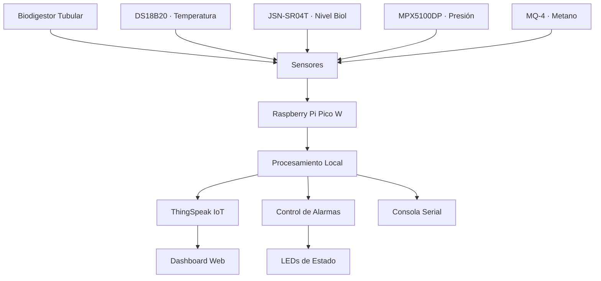

# 🌱 Sistema de Monitoreo IoT para Biodigestor Anaeróbico

<div align="center">


**Sistema de monitoreo IoT de código abierto para biodigestor anaeróbico tubular**  
*Institución Educativa San José de Canalete, Córdoba, Colombia*

</div>

---

## Descripción

Este proyecto transforma residuos pecuarios y vegetales en biogás para generar energía eléctrica, garantizando la continuidad de las actividades académicas en una zona rural con suministro eléctrico inestable.

El sistema monitorea en tiempo real variables críticas del proceso de digestión anaeróbica — temperatura, presión del biogás, nivel de biol, concentración de metano y pH — utilizando una **Raspberry Pi Pico W** y sensores de bajo costo. Los datos se transmiten a una plataforma IoT para visualización y análisis remoto.

---

## Planteamiento del Problema

En el municipio de Canalete, Córdoba, la inestabilidad del suministro eléctrico afecta significativamente a las instituciones educativas rurales:

| Problema | Impacto |
|----------|---------|
| Cortes de energía frecuentes | Interrupción de clases |
| Equipos pedagógicos inutilizables | Reducción de la calidad educativa |
| Residuos orgánicos sin gestión | Emisiones de metano no controladas |

### Solución Propuesta

Un sistema de biodigestión anaeróbica con monitoreo inteligente que:

- Genera energía eléctrica a partir de residuos pecuarios locales
- Monitorea variables críticas en tiempo real mediante IoT
- Capacita a la comunidad educativa en tecnologías sostenibles
- Promueve un modelo de economía circular replicable

---

## Arquitectura del Sistema



### Componentes del Sistema

| Función | Componente |
|---------|-----------|
| Microcontrolador | Raspberry Pi Pico W |
| Sensor de Temperatura | DS18B20 |
| Sensor de Nivel de Biol | JSN-SR04T |
| Sensor de Presión de Biogás | MPX5100DP |
| Sensor de Gas Metano | MQ-4 |
| Convertidor ADC | ADS1115 |
| Regulador de Alimentación | LM2596 |

---

## Instalación

### Requisitos Previos

- Raspberry Pi Pico W con firmware MicroPython
- Thonny IDE instalado en el equipo de trabajo
- Componentes listados en [`hardware/BOM.md`](hardware/BOM.md)

### Pasos de Configuración

1. Clonar el repositorio:
   ```bash
   git clone https://github.com/tu-usuario/biodigestor-iot.git
   cd biodigestor-iot
   ```

2. Configurar las credenciales en `src/config.py`:
   ```python
   SSID = "nombre_red_wifi"
   PASSWORD = "contraseña"
   THINGSPEAK_API_KEY = "api_key"
   ```

3. Ajustar los umbrales del biodigestor en el mismo archivo de configuración.

4. Conectar los sensores siguiendo el diagrama en [`hardware/`](hardware/).

5. Copiar todos los archivos de `src/` a la Pico W mediante Thonny.

6. Ejecutar `main.py`.

---

## Variables Monitoreadas

| Variable | Sensor | Rango Típico | Umbral Crítico |
|----------|--------|-------------|----------------|
| Temperatura | DS18B20 | 30 – 40 °C | < 25 °C o > 45 °C |
| Nivel de Biol | JSN-SR04T | 20 – 80 cm | > 90 cm (rebose) |
| Presión de Biogás | MPX5100DP | 0 – 5 kPa | > 10 kPa |
| Concentración de Metano | MQ-4 | < 1000 PPM | > 5000 PPM |
| pH *(trabajo futuro)* | Genérico | 6.5 – 7.5 | < 6.0 o > 8.0 |

---

## Impacto Educativo y Social

El proyecto contempla las siguientes acciones de apropiación social del conocimiento:

- Dos talleres teórico-prácticos dirigidos a docentes, estudiantes y personal de la institución
- Elaboración de material didáctico: manuales, infografías y videos educativos
- Plan de mantenimiento comunitario para garantizar la sostenibilidad a largo plazo
- Participación en eventos de difusión científica y tecnológica

### Objetivos de Desarrollo Sostenible (ODS)

| ODS | Descripción |
|-----|-------------|
| ODS 4 | Educación de Calidad |
| ODS 7 | Energía Asequible y No Contaminante |
| ODS 13 | Acción por el Clima |

---

## Equipo de Investigación

| Rol | Nombre | Institución | Programa |
|-----|--------|------------|----------|
| Investigador Principal | Rafael Gustavo Ramos Noriega | Universidad Pontificia Bolivariana | Ingeniería Electrónica |
| Directora | Ana Milena López López | Universidad Pontificia Bolivariana | Ciencias Básicas |
| Co-director | Carlos Andrés Marenco Porto | Universidad Pontificia Bolivariana | Ingeniería Mecánica |

---

## Documentación

| Documento | Descripción |
|-----------|-------------|
| [Especificación Técnica](docs/technical-spec.md) | Detalles de diseño del sistema |
| [Guía de Ensamblaje](docs/assembly-guide.md) | Instrucciones de montaje del hardware |
| [Guía de Implementación](docs/implementation-guide.md) | Despliegue del sistema completo |
| [Impacto Tech4Good](docs/impact.md) | Análisis de impacto social y ambiental |
| [Lista de Materiales](hardware/BOM.md) | Componentes y referencias comerciales |

---

## Contribuciones

Las contribuciones son bienvenidas. Por favor, consulte el archivo [`CONTRIBUTING_ES.md`](CONTRIBUTING_ES.md) para conocer las pautas del proyecto antes de enviar un *pull request*.

---

## Licencia

El software está distribuido bajo la [Licencia MIT](LICENSE).  
El hardware es de código abierto bajo la [CERN Open Hardware Licence v2 - Strongly Reciprocal (CERN-OHL-S-2.0)](https://ohwr.org/cern_ohl_s_v2.txt).

---

## Contacto

**Rafael Gustavo Ramos Noriega**  
Correo: [rafael.ramosn@upb.edu.co](mailto:rafael.ramosn@upb.edu.co)  
Universidad Pontificia Bolivariana — Seccional Montería
